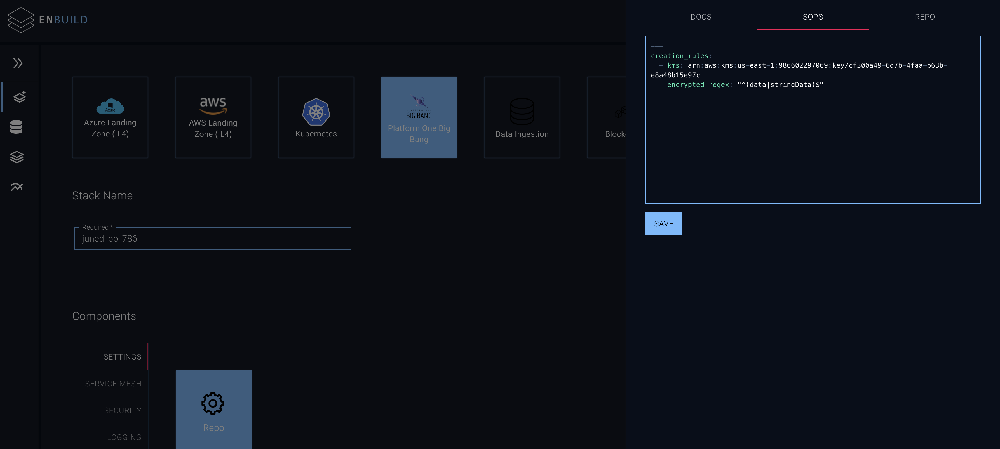
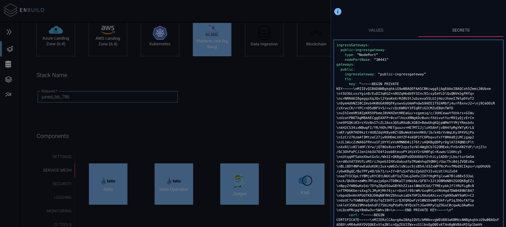
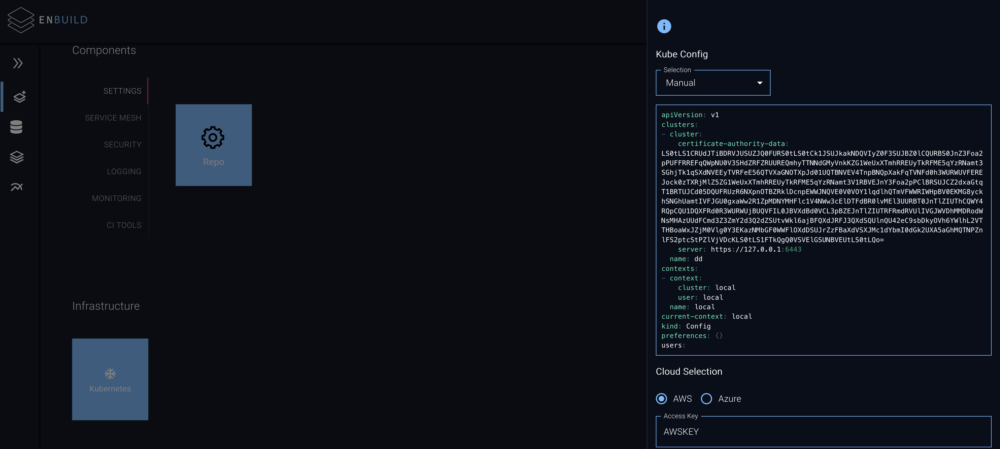
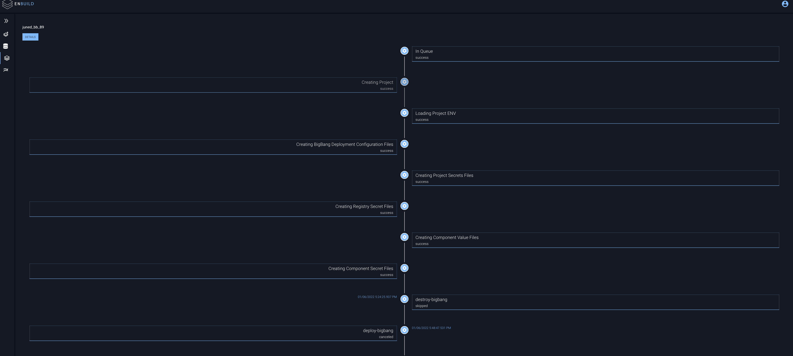

# Deploying the BigBang using Enbuild

## Prerequisite

1. You have created the KMS encryption key to encrypt your cluster and have the ARN of the KMS key handy.
2. You have deployed the Kubernetes and have access to `kubeconfig` file. 
3. All your worker nodes have instance profile with a policy to use KMS:decrypt 

## Create the KMS encryption key

You can create manually or via automation. Its of type **`Customer-managed keys`** and make sure the person deploying the bigbang is added into the key policy to allow `kms:Encrypt` and `kms:Decrypt` 

```bash
{
    "Version": "2012-10-17",
    "Statement": [
        {
            "Sid": "1",
            "Effect": "Allow",
            "Principal": {
                "AWS": [
                    "arn:aws:iam::986602297069:user/jmemon@vivsoft.io",
                    "arn:aws:iam::986602297069:user/tkaza@vivsoft.io"
                ]
            },
            "Action": [
                "kms:Update*",
                "kms:UntagResource",
                "kms:TagResource",
                "kms:ScheduleKeyDeletion",
                "kms:Revoke*",
                "kms:Put*",
                "kms:List*",
                "kms:Get*",
                "kms:Enable*",
                "kms:Disable*",
                "kms:Describe*",
                "kms:Delete*",
                "kms:Create*",
                "kms:CancelKeyDeletion"
            ],
            "Resource": "*"
        },
        {
            "Sid": "2",
            "Effect": "Allow",
            "Principal": {
                "AWS": [
                    "arn:aws:iam::986602297069:user/jmemon@vivsoft.io",
                    "arn:aws:iam::986602297069:user/tkaza@vivsoft.io"
                ]
            },
            "Action": [
                "kms:ReEncrypt*",
                "kms:GenerateDataKey*",
                "kms:Encrypt",
                "kms:DescribeKey",
                "kms:Decrypt"
            ],
            "Resource": "*"
        },
        {
            "Sid": "3",
            "Effect": "Allow",
            "Principal": {
                "AWS": [
                    "arn:aws:iam::986602297069:role/demo-control-plane",
                    "arn:aws:iam::986602297069:role/demo-worker"
                ]
            },
            "Action": [
                "kms:DescribeKey",
                "kms:Decrypt"
            ],
            "Resource": "*"
        }
    ]
}
```

Once created and note down the ARN of the KMS key you created, and create the `sops.yaml` file in below format , changing the `ADD_YOUR_KMS_KEY_ARN_HERE` with your actual `ARN.`

This file we will use whole deploying BigBang.

```bash
---
creation_rules:
  - kms: ADD_YOUR_KMS_KEY_ARN_HERE 
    encrypted_regex: "^(data|stringData)$"
```

## Create Kubernetes Cluster

It does not matter how you create the kubernetes cluster , but you should have access to kubeconfig file. 

The cluster also have enough resources ( memory/cpu/) to run the bigbang nodes. 

The cluster-api server should be publicly accessible so that public gitlab ci-cd can access it. 

## Worker node instance Profile

All worker nodes in your cluster must have an instance profile , which have a policy to allowing  the kms:decrypt and describe permission, 

See, sample policy below ,  Change your KMS key ARN 

```bash
{
    "Version": "2012-10-17",
    "Statement": [
        {
            "Sid": "",
            "Effect": "Allow",
            "Action": [
                "kms:DescribeKey",
                "kms:Decrypt"
            ],
            "Resource": "ADD_YOUR_KMS_KEY_ARN_HERE"
        }
    ]
}
```

### **Create GPG Encryption Key**

Generate the gpg key with name `bigbang-sops`

```bash
# Generate a GPG master key
# The GPG key fingerprint will be stored in the $fp variable
export fp=`gpg --quick-generate-key bigbang-sops rsa4096 encr | sed -e 's/ *//;2q;d;'`
gpg --quick-add-key ${fp} rsa4096 encr

echo ${fp}
```

Now create  a secret in your cluster with SOPS private key for Big Bang to decrypt secrets at run time. 

```bash
kubectl create namespace bigbang

gpg --export-secret-key --armor ${fp} | kubectl create secret generic sops-gpg -n bigbang --from-file=bigbangkey.asc=/dev/stdin

kubectl get secret -n bigbang sops-gpg
```

The sops value for your BigBang Deployment will be as below,

```bash
---
creation_rules:
- encrypted_regex: '^(data|stringData)$'
  pgp: EEF17D87C3954A2AE9D406811D17192D335BBD12
```

## Deploy BigBang

- Login to Enbuild - [https://enbuild.vivplatform.io/#/stack](https://enbuild.vivplatform.io/#/stack)
- Click on the **Create Stack**
- Select the **Platform One BigBang**
- At the SOPS tab provide the `sops.yaml` created on SOPS prerequisite section.
- At the REPO tab , provide the
    1. Registry URL  — The container registry from where you are pulling the images for flux deployment. 
    2. Registry Username - The container registry username to pull flux images 
    3. Registry Password - The container registry password to pull flux images 
    4. Repository Username - The gitlab repository username to pull the BigBang Helm chart. ( We have cloned the chart at - [https://gitlab.com/enbuild-staging/charts/bigbang.git](https://gitlab.com/enbuild-staging/charts/bigbang.git) 
    5. Repository Password  - The gitlab repository password to pull the BigBang Helm chart. ( We have cloned the chart at - [https://gitlab.com/enbuild-staging/charts/bigbang.git](https://gitlab.com/enbuild-staging/charts/bigbang.git) )
- Provide the name for your deployment



- Next, in the Component → Setting → Repo Section click on the Secret Tab, and provide the `registryCredentials` and `git credentials`  this is basically used by BigBang Helm chart to pull the container images and cloning the dependant helm charts used by bigbang.
    - The values of these will be same as previous section.

---

```bash
registryCredentials:
  registry: [registry.gitlab.com](http://registry.gitlab.com/)
  username: registry_username
  password: registry_password
  email: ""
git:
  credentials:
  username: repository_usernane
  password: registry_password
```

- Similarly you can check other components and edit the values of the component deployment. If you feel the value is sensitive you can add that in secrets tab, so that enbuild will encrypt it using the KMS key provided before committing to the git repo.

One important component setting while deploying BigBang is 

`domain: [bigbang.dev](http://bigbang.dev)` which is present in Settings → Repo → Values.  This defines the istio ingress domain on which the bigbang applications will be available. 

You also have to provide the right tls certificate and key for the same domain defined above in the Component → Service Mesh → Istio → Secrets tab.  So that you can access the bigbang applications in browser without any security/certificate warning. 



- After providing all the input values, proceed to Infrastructure section, and provide your
    - kubeconfig file - Paste your `kubeconfig` file
    - Select AWS as your cloud and provide your AWS credentials. These AWS credentials are used to encrypt the secrets using SOPS. So make sure the IAM user of these credentials is having `kms:Encrypt` and `kms:Decrypt`  permissions.
    
    
    
    Once all inputs are provided click on **Create Stack**
    
    ## Checking the Deployment Status
    
    Once you create a deployment , you can check the deployment status from a stacks page. 
    
    It will have different phases as listed below 
    
    
    
    You can also check the status of CI-CD run directly in the gitlab. 
    
    Go to the project created in gitlab and click on the CI-CD tab and check running/completed jobs.