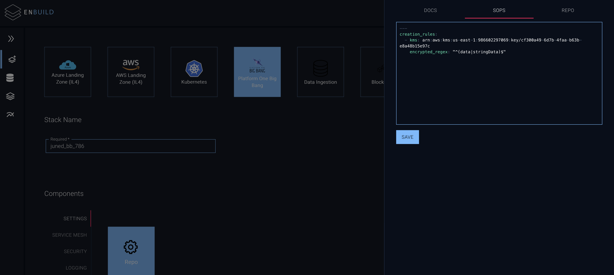
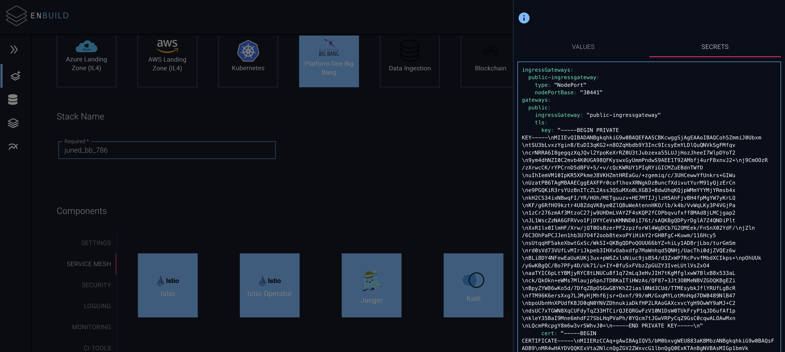
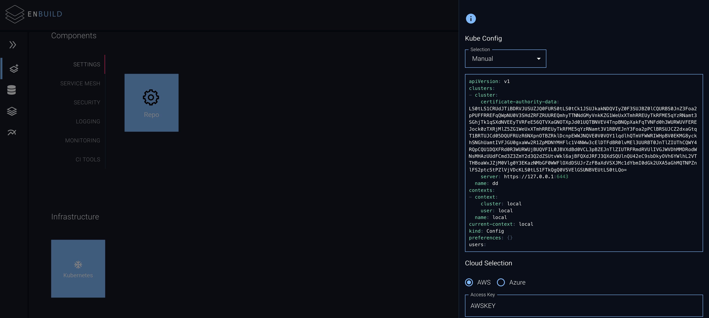
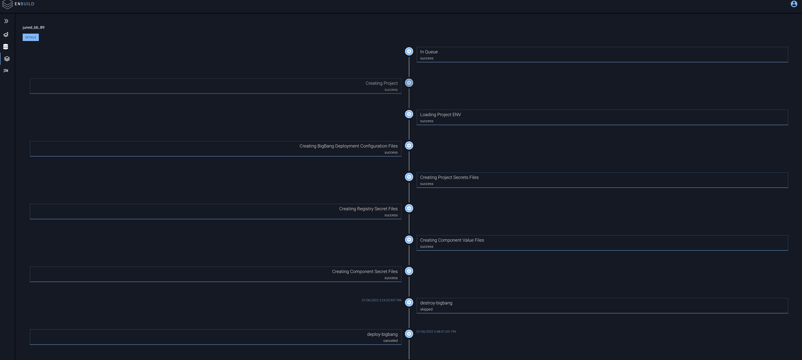

# Deploying the BigBang using Enbuild

This guide documents the generic Big Bang deployment flow.

If you are deploying Big Bang to AKS and using Azure Key Vault for SOPS
decryption, use the AKS-specific guide alongside this document:

- [Deploying Big Bang on AKS with Azure Key Vault SOPS](./AKS-Azure-KeyVault-SOPS.md)

Important:

- This document is primarily AWS/EKS-oriented.
- If you are deploying to AKS, do not follow the AWS KMS or GPG sections as-is.
- For AKS, use Azure Key Vault as the SOPS backend and follow the AKS guide for
  Workload Identity, runner kubeconfig handling, and user-supplied overrides.

## Prerequisite

1. You have created a KMS encryption key to encrypt your cluster and have the ARN of the KMS key handy.
2. You have deployed a Kubernetes cluster and have access to the `kubeconfig`
   file.
3. All your worker nodes have an instance profile with a policy to use KMS:decrypt 

## Create the KMS encryption key

You can create manually or via automation. Its of type **`Customer-managed keys`** and make sure the person deploying the bigbang is added into the key policy to allow `kms:Encrypt` and `kms:Decrypt` 

```bash
{
    "Version": "2012-10-17",
    "Statement": [
        {
            "Sid": "1",
            "Effect": "Allow",
            "Principal": {
                "AWS": [
                    "arn:aws:iam::986602297069:user/jmemon@vivsoft.io",
                    "arn:aws:iam::986602297069:user/tkaza@vivsoft.io"
                ]
            },
            "Action": [
                "kms:Update*",
                "kms:UntagResource",
                "kms:TagResource",
                "kms:ScheduleKeyDeletion",
                "kms:Revoke*",
                "kms:Put*",
                "kms:List*",
                "kms:Get*",
                "kms:Enable*",
                "kms:Disable*",
                "kms:Describe*",
                "kms:Delete*",
                "kms:Create*",
                "kms:CancelKeyDeletion"
            ],
            "Resource": "*"
        },
        {
            "Sid": "2",
            "Effect": "Allow",
            "Principal": {
                "AWS": [
                    "arn:aws:iam::986602297069:user/jmemon@vivsoft.io",
                    "arn:aws:iam::986602297069:user/tkaza@vivsoft.io"
                ]
            },
            "Action": [
                "kms:ReEncrypt*",
                "kms:GenerateDataKey*",
                "kms:Encrypt",
                "kms:DescribeKey",
                "kms:Decrypt"
            ],
            "Resource": "*"
        },
        {
            "Sid": "3",
            "Effect": "Allow",
            "Principal": {
                "AWS": [
                    "arn:aws:iam::986602297069:role/demo-control-plane",
                    "arn:aws:iam::986602297069:role/demo-worker"
                ]
            },
            "Action": [
                "kms:DescribeKey",
                "kms:Decrypt"
            ],
            "Resource": "*"
        }
    ]
}
```

Once created and you noted down the ARN of the KMS key you created, and create the `sops.yaml` file in below format , changing the `ADD_YOUR_KMS_KEY_ARN_HERE` with your actual `ARN.`

This file we will use when deploying BigBang.

```bash
---
creation_rules:
  - kms: ADD_YOUR_KMS_KEY_ARN_HERE 
    encrypted_regex: "^(data|stringData)$"
```

## Create Kubernetes Cluster

It does not matter how you create the kubernetes cluster, but you should have
access to a kubeconfig file.

The cluster also has enough resources ( memory/cpu/) to run the bigbang nodes. 

The cluster-api server should be publicly accessible so that the public gitlab ci-cd feature can access it. 

The CI job should receive kubeconfig as a file. For GitLab, prefer a file-type
CI variable. For GitHub Actions, materialize the secret content into a file in
the workflow before invoking `deploy.sh`.

Do not move kubeconfig content-to-file normalization into the shared AKS
template defaults. Treat that as a runner/workflow responsibility.

## Worker node instance Profile

All worker nodes in your cluster must have an instance profile, which have a policy allowing the kms:decrypt and describe permissions, 

See, sample policy below,  Change your KMS key ARN 

```bash
{
    "Version": "2012-10-17",
    "Statement": [
        {
            "Sid": "",
            "Effect": "Allow",
            "Action": [
                "kms:DescribeKey",
                "kms:Decrypt"
            ],
            "Resource": "ADD_YOUR_KMS_KEY_ARN_HERE"
        }
    ]
}
```

### **Create a GPG Encryption Key**

Generate a gpg key with name `bigbang-sops`

```bash
# Generate a GPG master key
# The GPG key fingerprint will be stored in the $fp variable
export fp=`gpg --quick-generate-key bigbang-sops rsa4096 encr | sed -e 's/ *//;2q;d;'`
gpg --quick-add-key ${fp} rsa4096 encr

echo ${fp}
```

Now create a secret in your cluster with SOPS private key for Big Bang to decrypt secrets at run time. 

```bash
kubectl create namespace bigbang

gpg --export-secret-key --armor ${fp} | kubectl create secret generic sops-gpg -n bigbang --from-file=bigbangkey.asc=/dev/stdin

kubectl get secret -n bigbang sops-gpg
```

The sops value for your BigBang Deployment will be as follows,

```bash
---
creation_rules:
- encrypted_regex: '^(data|stringData)$'
  pgp: EEF17D87C3954A2AE9D406811D17192D335BBD12
```

## Deploy BigBang

- Login to Enbuild - [https://enbuild.vivplatform.io/#/stack](https://enbuild.vivplatform.io/#/stack)
- Click on **Create Stack** 
- Select **Platform One BigBang**
- At the SOPS tab provide the `sops.yaml` created on SOPS prerequisite section.
- At the REPO tab, provide the
    1. Registry URL — The container registry from where you are pulling the images for flux deployments. 
    2. Registry Username - The container registry username to pull flux images 
    3. Registry Password - The container registry password to pull flux images 
    4. Repository Username - The gitlab repository username to pull BigBang Helm charts. ( We have cloned the chart at - [https://gitlab.com/enbuild-staging/charts/bigbang.git](https://gitlab.com/enbuild-staging/charts/bigbang.git) 
    5. Repository Password  - The gitlab repository password to pull BigBang Helm charts. ( We have cloned the chart at - [https://gitlab.com/enbuild-staging/charts/bigbang.git](https://gitlab.com/enbuild-staging/charts/bigbang.git) )
- Provide a name for your deployment



- Next, in the Component → Setting → Repo Section, click on the Secrets Tab, and provide the `registryCredentials` and `git credentials`. This is basically used by BigBang Helm charts to pull the container images and clone the dependant helm charts used by bigbang.
    - The values of these will be same as previous section.

---

```bash
registryCredentials:
  registry: [registry.gitlab.com](http://registry.gitlab.com/)
  username: registry_username
  password: registry_password
  email: ""
git:
  credentials:
  username: repository_usernane
  password: registry_password
```

- Similarly, you can check other components and edit the values of the component deployment. If you wish to secure the value, you can add that in secrets tab, so that enbuild will encrypt it using the KMS key provided before committing to the git repo.

One important component setting required when deploying BigBang is 

`domain: [bigbang.dev](http://bigbang.dev)` which is present in Settings → Repo → Values.  This defines the istio ingress domain on which the bigbang applications will be available. 

You also have to provide the right tls certificate and key for the same domain defined above in the Component → Service Mesh → Istio → Secrets tab.  So that you can access the bigbang applications in a browser without any security/certificate warnings. 



- After providing all the input values, proceed to the Infrastructure section, and provide your
    - kubeconfig file - Provide your `kubeconfig` file
    - Select the appropriate cloud and provide the matching credentials.
      For AWS/EKS, use the AWS KMS guidance in this document.
      For AKS, use the Azure Key Vault guidance in the AKS document and provide
      any AKS-specific values and secrets through ENBUILD rather than changing
      shared template defaults.
    
    
    
    Once all inputs are provided click on **Create Stack**
    
    ## Checking the Deployment Status
    
    Once you create a deployment, you can check the deployment status from a stacks page. 
    
    It will have different phases as listed below 
    
    
    
    You can also check the status of CI-CD run directly in the gitlab. 
    
    Go to the project created in gitlab and click on the CI-CD tab and check running/completed jobs.

## Destroying BigBang

Run the generated repo's `destroy-bigbang` job before destroying the backing EKS
cluster.

For AWS-backed clusters, the destroy flow now also cleans up the two Istio
gateway classic ELBs (`public-ingressgateway` and
`passthrough-ingressgateway`) and removes any leaked `k8s-elb-*` security
groups that would otherwise block the final VPC teardown.

Recommended order:

1. Destroy the sample app stack
2. Run `destroy-bigbang`
3. Destroy the EKS stack
